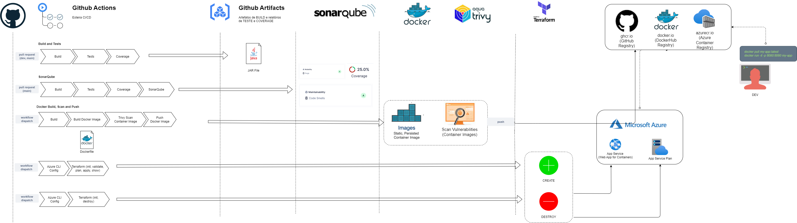
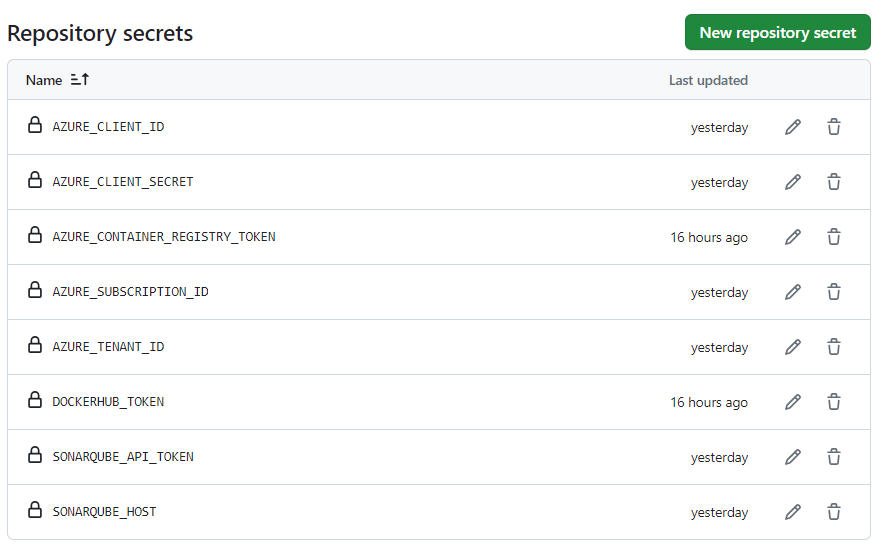
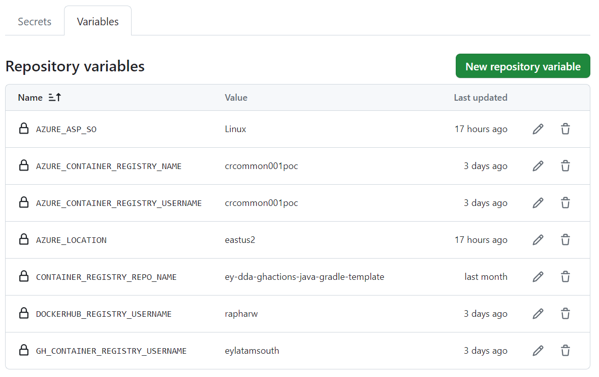
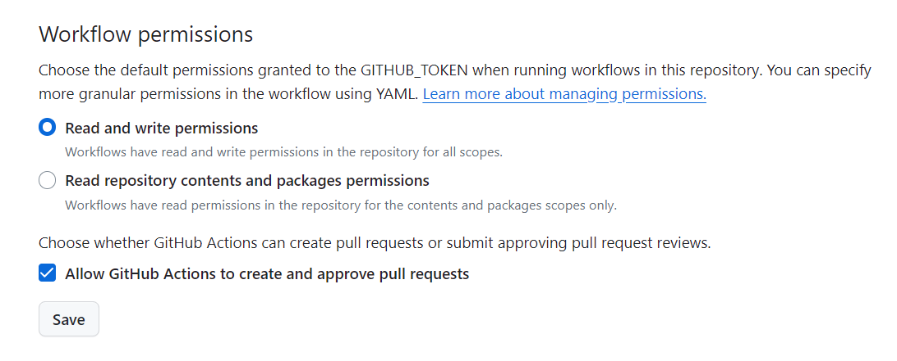
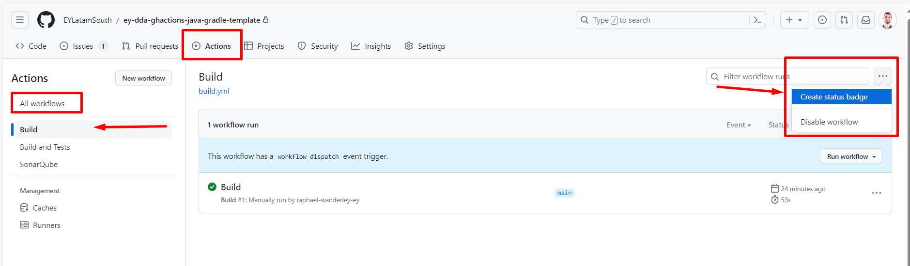
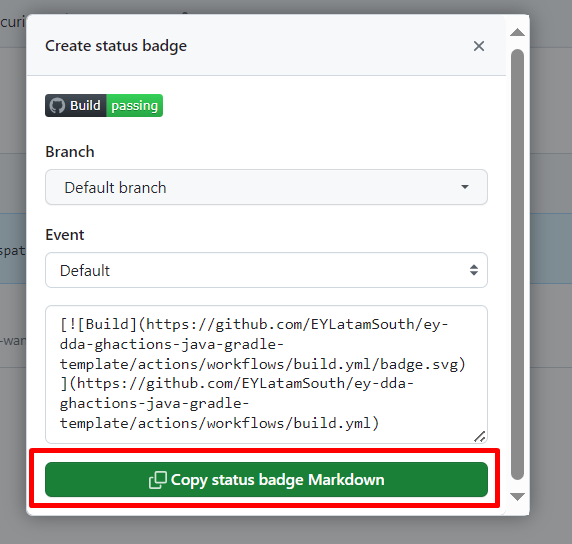
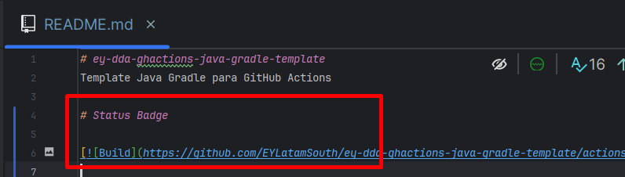

# ghactions-java-gradle-webappforcontainers
Template Java Gradle para GitHub Actions, com as configurações de:

- Build
- Testes com Coverage
- Análise de SonarQube
- Docker (build, trivy scan, push - "ghcr.io")
- Terraform (Azure Web App for Containers)

A ideia deste template é tornar uma aplicação Java Gradle (Spring Boot) plug-and-play com a pipeline descrita anteriormente.

# Sobre




# Status Badges

[](https://github.com/rapharw/ghactions-java-gradle-webappforcontainers/actions/workflows/build.yml)

[](https://github.com/rapharw/ghactions-java-gradle-webappforcontainers/actions/workflows/build-and-tests.yml)

[](https://github.com/rapharw/ghactions-java-gradle-webappforcontainers/actions/workflows/sonarqube.yml)

[](https://github.com/rapharw/ghactions-java-gradle-webappforcontainers/actions/workflows/docker.yml)

[](https://github.com/rapharw/ghactions-java-gradle-webappforcontainers/actions/workflows/az-webappforcontainers-create.yml)

[](https://github.com/rapharw/ghactions-java-gradle-webappforcontainers/actions/workflows/az-webappforcontainers-create.yml)

# Tecnologias

- Java 11
- Gradle
- Spring Boot
- GitHub Actions
- SonarQube (9.9-community)
- Docker
- Aqua Trivy
- Terraform
- Azure (Web App for Containers)

# GitHub Actions 

## Secrets e Variables

Criar as seguintes Secrets e Variables no GitHub:



```properties
AZURE_CLIENT_ID=<your-service-principal-client-id>
AZURE_CLIENT_SECRET=<your-service-principal-client-secret>
AZURE_SUBSCRIPTION_ID=<your-subscription-id>
AZURE_TENANT_ID=<your-azure-tenant-id>
CONTAINER_REGISTRY_TOKEN=<container-registry-token>
SONARQUBE_API_TOKEN=<sonarqube-token>
SONARQUBE_HOST=<sonarqube-host>
```



```properties
AZURE_ASP_SO=<your-app-service-plan-so>
AZURE_LOCATION=<your-azure-location-name>
CONTAINER_REGISTRY_REPO_NAME=<container-registry-repository-name>
CONTAINER_REGISTRY_USERNAME=<container-registry-username>
```

**OBS**: Desta forma, a solução estará apta a executar o fluxo de pipeline proposto.

## Workflows

**OBS**: Para criar um novo workflow, basta criar um arquivo `.yml` na pasta `.github/workflows/` do seu repositório, e configurá-lo apropriadamente.

A seguir encontram-se os workflows existentes.

### Build

Arquivo `build.yml`

### Build e Testes com Coverage

Arquivo `build-and-tests.yml`

**Pré-requisitos**:

- JaCoCo Report Tests configurado (ver `build.gradle`)

### Build, Testes com Coverage e SonarQube

Arquivo `sonarqube.yml`

**Pré-requisitos**:

- JaCoCo Report Tests configurado (ver `build.gradle`)
- Secrets configuradas (`SONARQUBE_API_TOKEN`, `SONARQUBE_HOST`)
- Arquivo `sonar-project.properties` configurado

### Build e Docker (Login, Build, Scan - _Aqua Trivy_, e Push to GHCR)

**Este exemplo utiliza `CONTAINER REGISTRY` do GitHub (`ghcr`)**, para armazenamento das imagens de container

**OBS:** Criar as variáveis de ambiente `CONTAINER_REGISTRY_USERNAME` e `CONTAINER_REGISTRY_REPO_NAME` no repositório

#### Habilitar Workflow Permissions



### Terraform (Criar e Destruir Azure Web App for Containers)


## GitHub Actions (Status Badge)

Para criar um status badge, siga os passos abaixo, e inclua o código gerado no seu `README.md`, na seção `[Ir para Seção de Exemplo](#status)`

1. Crie uma status badge

    

2. Copie o código gerado

    

3. Cole o código no seu `README.md`

    
