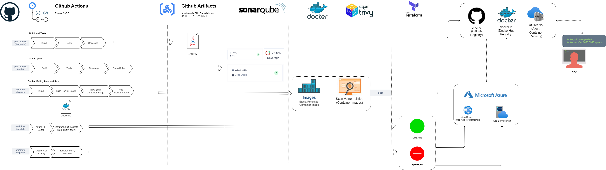
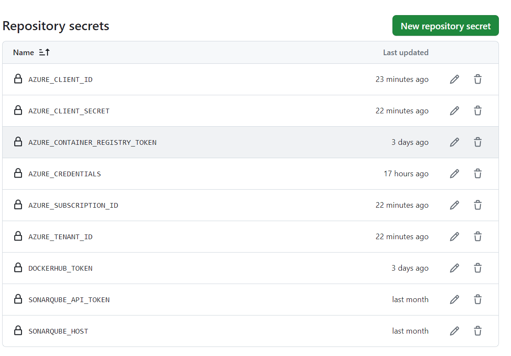
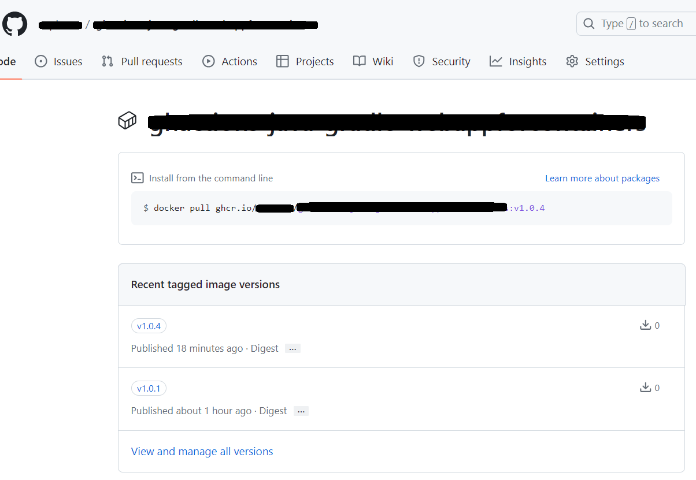
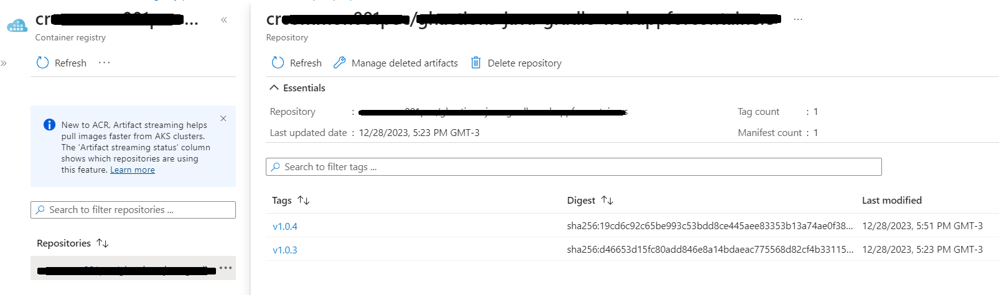
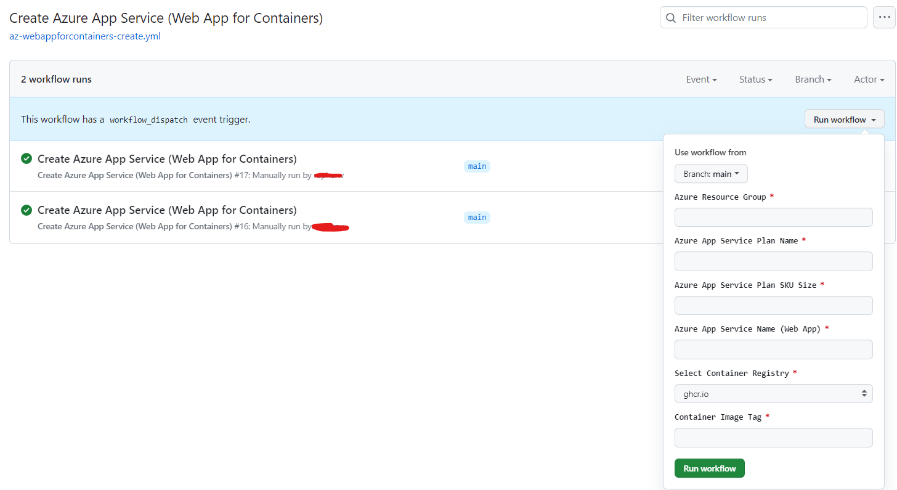

# ghactions-java-gradle-webappforcontainers
Template Java Gradle para GitHub Actions, com as configurações de:

- Build
- Testes com Coverage
- Análise de SonarQube
- Docker (build, trivy scan, push) - _ghcr.io, dockerhub, azurecr.io_
- Terraform (Azure Web App for Containers)

A ideia deste template é tornar uma aplicação Java Gradle (Spring Boot) plug-and-play com a pipeline proposta.

# Sobre

## Pipeline

# Menu

- [Sobre](#sobre)
- [Tecnologias](#tecnologias)
- [Workflows Status](#workflows-status)
- [Instalação](#instalação)
  - [GitHub Actions (Secrets e Variables)](#github-actions-secrets-e-variables)

# Tecnologias

- Java 11
- Gradle
- Spring Boot
- GitHub Actions
- SonarQube
- Docker
- Aqua Trivy
- Copacetic (apenas para ghcr.io)
- Terraform
- Azure (Web App for Containers)

# Workflows Status

## Build e Testes

## SonarQube 

## Docker

## Terraform

# Instalação

## GitHub Actions (Secrets e Variables)

Criar as seguintes _Secrets_ e _Variables_ no **GitHub**:

**OBS**: Desta forma, a solução estará apta a executar todo fluxo de pipeline proposto.

## SonarQube

Configurar as _Secrets_ `SONARQUBE_HOST` e `SONARQUBE_API_TOKEN` habilitará o scan de anáise de código.

**OBS**: Necessário criar o arquivo `sonar-project.properties`, para que o SonarQube funcione devidamente.

## GitHub Workflow Permissions (Actions)

Habilitar esta opção para que o `GITHUB_TOKEN` possua acesso dentro da pipeline. 

## Workflows - TD;DR

A seguir encontram-se os workflows existentes.

#### Build

Arquivo `build.yml`

#### Build e Testes com Coverage

Arquivo `build-and-tests.yml`

**Pré-requisitos**:

- JaCoCo Report Tests configurado (ver `build.gradle`)

#### Build, Testes com Coverage e SonarQube

Arquivo `sonarqube.yml`

**Pré-requisitos**:

- JaCoCo Report Tests configurado (ver `build.gradle`)
- Secrets configuradas (`SONARQUBE_API_TOKEN`, `SONARQUBE_HOST`)
- Arquivo `sonar-project.properties` configurado

#### Build e Docker (Login, Build, Scan - _Aqua Trivy_, e Push)

Utiliza-se de `CONTAINER REGISTRY` dos providers _ghcr.io, dockerhub, azurecr.io_, para armazenamento das imagens de container:

###### Workflow execution

Ao executar o workflow `Docker`, selecione qual `Container Registry` será armazenada a imagem de container: 

###### Resultado 

- GitHub (`ghcr.io`)
   
- DockerHub (`docker.io`)
   
- Azure (`azurecr.io`)
   

#### Ver mais

Para criar um novo workflow, basta criar um arquivo `.yml` na pasta `.github/workflows/` do seu repositório, e configurá-lo apropriadamente.

### Terraform (Criar e Destruir Azure Web App for Containers)

Para executar o workflow de criação IaC, informar os seguintes inputs:

### Criar Status Badge (workflows)

Para criar um status badge, siga os passos abaixo, e inclua o código gerado no seu `README.md`

1. Crie uma status badge

    

2. Copie o código gerado

    

3. Cole o código no seu `README.md`

    
