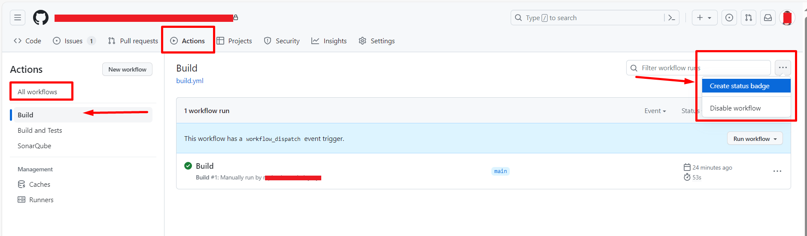
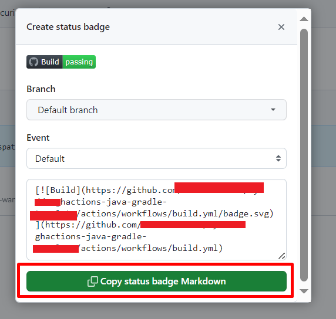
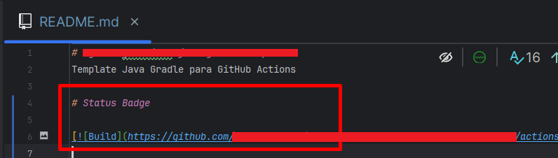

# ghactions-java-gradle-webappforcontainers
Template Java Gradle para GitHub Actions, com as configurações de:

- Build
- Testes com Coverage
- Análise de SonarQube
- Docker (build, trivy scan, push - "ghcr.io")
- Terraform (Azure Web App for Containers)

A ideia deste template é tornar uma aplicação Java Gradle (Spring Boot) plug-and-play com a pipeline descrita anteriormente.

# Sobre


# Status


# Configuração

- Java 11
- Gradle
- Spring Boot

## GitHub Actions 

Para criar um workflow, basta criar um arquivo `.yml` na pasta `.github/workflows/` do seu repositório.

### Build

Arquivo `build.yml`

```yaml
name: Build

on:
  workflow_dispatch:

jobs:
  Build:
    runs-on: ubuntu-22.04
    steps:
      - uses: actions/checkout@v4
      - name: Set up JDK 11
        uses: actions/setup-java@v3
        with:
          java-version: 11
          distribution: 'adopt'

      - name: Make gradlew executable
        run: chmod +x ./gradlew

      - name: Build with Gradle
        run: ./gradlew bootJar

      - uses: actions/upload-artifact@v3
        with:
          path: ./*/*/*.jar
          if-no-files-found: error
```

### Build e Testes com Coverage

Arquivo `build-and-tests.yml`

Pré-requisitos:

- JaCoCo Report Tests configurado (ver `build.gradle`)


```yaml
name: Build and Tests

on:
  pull_request:
    branches:
      - dev
    
  workflow_dispatch:

jobs:
  BuildAndTests:
    runs-on: ubuntu-22.04
    steps:
      - uses: actions/checkout@v4
      - name: Set up JDK 11
        uses: actions/setup-java@v3
        with:
          java-version: 11
          distribution: 'adopt'

      - name: Make gradlew executable
        run: chmod +x ./gradlew

      - name: Build with Gradle
        run: ./gradlew bootJar

      - uses: actions/upload-artifact@v3
        with:
          path: ./*/*/*.jar
          if-no-files-found: error

      - name: Run Tests
        run: ./gradlew test --info

      - name: Upload Jacoco Coverage
        uses: actions/upload-artifact@v2
        with:
          name: jacoco-report
          path: build/reports/jacoco/test/html
```

### Build, Testes com Coverage e SonarQube

Arquivo `sonarqube.yml`

Pré-requisitos:

- JaCoCo Report Tests configurado (ver `build.gradle`)
- Secrets configuradas (`SONARQUBE_API_TOKEN`, `SONARQUBE_HOST`)
- Arquivo `sonar-project.properties` configurado

```yaml
name: SonarQube

on:
  pull_request:
    branches:
      - main
    
  workflow_dispatch:

jobs:
  SonarQube:
    runs-on: ubuntu-22.04
    steps:
      - uses: actions/checkout@v4
      - name: Set up JDK 11
        uses: actions/setup-java@v3
        with:
          java-version: 11
          distribution: 'adopt'

      - name: Make gradlew executable
        run: chmod +x ./gradlew

      - name: Build with Gradle
        run: ./gradlew bootJar

      - uses: actions/upload-artifact@v3
        with:
          path: ./*/*/*.jar
          if-no-files-found: error

      - name: Run Tests
        run: ./gradlew test --info

      - name: Upload Jacoco Coverage
        uses: actions/upload-artifact@v2
        with:
          name: jacoco-report
          path: build/reports/jacoco/test/html
      
      - name: Official SonarQube Scan
        uses: SonarSource/sonarqube-scan-action@v1.1.0
        env:
          SONAR_HOST_URL: ${{ secrets.SONARQUBE_HOST }}
          SONAR_TOKEN: ${{ secrets.SONARQUBE_API_TOKEN }}
          
      - name: SonarQube Quality Gate Check
        uses: SonarSource/sonarqube-quality-gate-action@v1.1.0
        timeout-minutes: 5
        continue-on-error: true
        env:
          SONAR_HOST_URL: ${{ secrets.SONARQUBE_HOST }}
          SONAR_TOKEN: ${{ secrets.SONARQUBE_API_TOKEN }}
```

### Build e Docker (Build e Scan - _Aqua Trivy_)

```yaml
name: Docker

on:
  workflow_dispatch:

jobs:
  Build:
    runs-on: ubuntu-22.04
    steps:
      - uses: actions/checkout@v4
      - name: Set up JDK 11
        uses: actions/setup-java@v3
        with:
          java-version: 11
          distribution: 'adopt' # https://github.com/actions/setup-java#basic-configuration

      - name: Make gradlew executable
        run: chmod +x ./gradlew

      - name: Build with Gradle
        run: ./gradlew bootJar

      - uses: actions/upload-artifact@v3
        with:
          path: ./*/*/*.jar
          name: app
          if-no-files-found: error

  Docker:
    runs-on: ubuntu-22.04
    needs: Build
    steps:
      - uses: actions/checkout@v4

      - name: Download Artifact
        uses: actions/download-artifact@v3
        with:
          name: app

      - name: Build Docker Image
        run: |
          docker build --build-arg JAR_FILE='*.jar' -t ey/my-app .

      - name: Aqua Security Trivy (Container Image Scan)
        uses: aquasecurity/trivy-action@0.14.0
        with:
          image-ref: 'ey/my-app'
          format: 'table'
          exit-code: '1'
          ignore-unfixed: true
          vuln-type: 'os,library'
          severity: 'CRITICAL,HIGH'
```

### Build e Docker (Login, Build, Scan - _Aqua Trivy_, e Push to GHCR)

**Este exemplo utiliza `CONTAINER REGISTRY` do GitHub (`ghcr`)**, para armazenamento das imagens de container

```yaml
name: Docker

on:
  workflow_dispatch:

jobs:
  Build:
    runs-on: ubuntu-22.04
    steps:
      - uses: actions/checkout@v4
      - name: Set up JDK 11
        uses: actions/setup-java@v3
        with:
          java-version: 11
          distribution: 'adopt'

      - name: Make gradlew executable
        run: chmod +x ./gradlew

      - name: Build with Gradle
        run: ./gradlew bootJar

      - uses: actions/upload-artifact@v3
        with:
          path: ./*/*/*.jar
          name: app
          if-no-files-found: error

  Docker:
    runs-on: ubuntu-22.04
    needs: Build
    steps:
      - uses: actions/checkout@v4

      - name: Download Artifact
        uses: actions/download-artifact@v3
        with:
          name: app

      - name: Login to Docker Registry
        run: |
          export CR_PAT=${{ secrets.GITHUB_TOKEN }}
          echo $CR_PAT | docker login ghcr.io -u ${{ vars.CONTAINER_REGISTRY_USERNAME }} --password-stdin

      - name: Build Docker Image
        run: |
          docker build --build-arg JAR_FILE='*.jar' -t ghcr.io/${{ vars.CONTAINER_REGISTRY_USERNAME }}/${{ vars.CONTAINER_REGISTRY_REPO_NAME }}:latest .
          docker build --build-arg JAR_FILE='*.jar' -t ghcr.io/${{ vars.CONTAINER_REGISTRY_USERNAME }}/${{ vars.CONTAINER_REGISTRY_REPO_NAME }}:${{ github.event.release.name }} .

      - name: Aqua Trivy (Container Image Scan)
        uses: aquasecurity/trivy-action@0.14.0
        with:
          image-ref: 'ghcr.io/${{ vars.CONTAINER_REGISTRY_USERNAME }}/${{ vars.CONTAINER_REGISTRY_REPO_NAME }}:latest'
          format: 'table'
          exit-code: '1'
          ignore-unfixed: true
          vuln-type: 'os,library'
          severity: 'CRITICAL,HIGH'

      - name: Push Docker Image to Registry
        run: |
          docker push ghcr.io/${{ vars.CONTAINER_REGISTRY_USERNAME }}/${{ vars.CONTAINER_REGISTRY_REPO_NAME }}:latest
          docker push ghcr.io/${{ vars.CONTAINER_REGISTRY_USERNAME }}/${{ vars.CONTAINER_REGISTRY_REPO_NAME }}:${{ github.event.release.name }}
```

**OBS:** Criar as variáveis de ambiente `CONTAINER_REGISTRY_USERNAME` e `CONTAINER_REGISTRY_REPO_NAME` no repositório


## GitHub Actions (Status Badge)

Para criar um status badge, siga os passos abaixo, e inclua o código gerado no seu `README.md`, na seção `[Ir para Seção de Exemplo](#status)`

1. Crie uma status badge

    

2. Copie o código gerado

    

3. Cole o código no seu `README.md`

    
